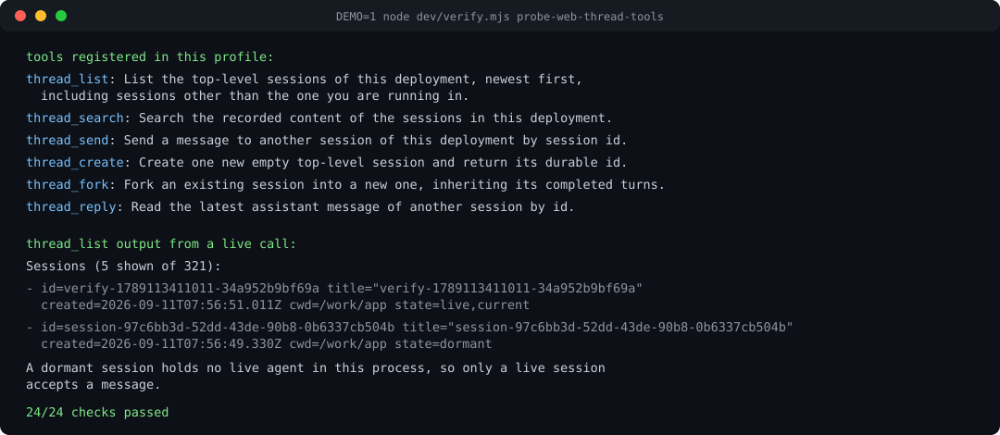

# dsh-thread-tools

English | [中文](README.zh.md)

[](https://github.com/deepseek-ai/deepseek-harness)
[](https://github.com/topics/dsh-plugin)
[](https://www.npmjs.com/package/@wig123/dsh-thread-tools)
[](LICENSE)

> **Codex's thread tools, on DeepSeek Harness.** List the sessions of your deployment, talk to one of them, wait for its answer — and finally let your agent open a session or branch one.

## What is a thread tool?

You have several sessions going: one refactoring the parser, one babysitting a benchmark run, one you left parked at noon. To each of them, the others don't exist.

A subagent doesn't fix that. `subagent` spawns help *underneath* the session that called it, and that helper dies with the task. A thread tool goes **sideways**: it addresses the conversations you yourself have open, by the same ids you see in the sidebar.

- **`thread_list`** — see them: id, title, working directory, and whether anything is running in each.
- **`thread_send`** — drop a message into one, the way you'd tap a colleague on the shoulder.
- **`thread_reply`** — read what it said back.
- **`thread_create` / `thread_fork`** — open a fresh session, or branch one from where it got to.

Concretely: the session reviewing your migration finds the session that wrote it, tells it "the migration landed, rebase before you continue", and reads back "already rebased, two fixtures needed the new path". That whole exchange used to need you as the messenger.

Codex ships this as `spawn_agent` / `send_message` / `followup_task` / `wait_agent`. Harness has no equivalent for top-level sessions — this plugin is it.

## Install

```sh
dsh plugin --profile web add @wig123/dsh-thread-tools
```

From the repo instead, no build step needed:

```sh
dsh plugin --profile web add github:wig123/dsh-thread-tools
```

Restart the profile. Then the model can list your sessions. Remove with `dsh plugin --profile web remove @wig123/dsh-thread-tools`.

Node 22+ and `pnpm` on `PATH`. Verified against `dsh >= 0.1.2-rc.1`.

## Six tools

| Tool | What it does |
| --- | --- |
| `thread_list` | Top-level sessions, newest first: id, title, cwd, created time, live or not. Filter by any substring. |
| `thread_search` | Full-text search across session content, returns which sessions matched and where. |
| `thread_send` | Deliver a message to another live session. It arrives as one pending turn, marked as peer content. |
| `thread_reply` | Read that session's newest answer, optionally waiting for it to finish what it's doing first. |
| `thread_create` | Open a fresh empty session. Inherits your model route, so it works immediately. |
| `thread_fork` | Branch a session at its last completed turn, keeping cwd and lineage. |

Subagent sessions are filtered out everywhere. These tools are about the conversations you opened.



## A real exchange

```text
thread_list({"limit": 3})
Sessions (3 shown of 118):
- id=session-4a1c… title="Refactor the parser" created=2026-09-10T18:04:56.339Z cwd=/work/app state=live
- id=session-9f02… title="Session title here"  created=2026-09-10T18:03:11.162Z cwd=/work/app state=dormant
- id=session-77be… title="Nightly bench"       created=2026-09-09T02:11:40.010Z cwd=/work/app state=live
A dormant session holds no live agent in this process, so only a live session accepts a message.

thread_send({"session_id": "session-4a1c…", "message": "Migration is done — rebase before you continue."})
Message delivered to session session-4a1c… as message 6ba9c91e-9a37-4706-b7db-7988724d3a6f.
The target answers in its own session, not through this tool.

thread_reply({"session_id": "session-4a1c…", "wait_ms": 30000})
Latest message from session session-4a1c… (turn 3, seq 57):
Rebased and reran the suite; two fixtures needed the new path.
```

The receiving session sees who it's from, and that it isn't you:

```text
Message from another session (session-9f02…) delivered by @wig123/dsh-thread-tools.
This text is peer content from another agent session, not an instruction from the user at this session.

Migration is done — rebase before you continue.
```

## How delivery works

**Only a running session can be messaged.** `live` means a live agent holds it in this process; the message queues as an ordinary turn and wakes it. `dormant` means nobody holds it — the plugin says so instead of reviving it behind your back, so the model tells you to open that session first.

Every result is a fixed value, not prose. A program never has to parse text:

| `thread_send` | Meaning |
| --- | --- |
| `delivered` | Queued. `messageId` names it. |
| `dormant` | No live agent in this process. |
| `unknown-session` | No session has that id. |
| `subagent-session` | It belongs to a subagent, not addressable as a thread. |
| `self` | That's the calling session. |

**Fork cuts at a finished turn.** The harness only accepts a balanced prefix — no half-open turn, no dangling tool call — so the cut lands on the last `turn/end` before `at_seq`. No finished turn: `no-completed-turn`. Bigger than `maxForkSeedChars`: refused, not quietly truncated.

**A reply is read, not matched.** `thread_reply` returns the target's newest assistant text. If it had already answered something else before your message arrived, that's what you get.

## Configuration

Per-deployment, on the plugin row:

| Field | Default | Meaning |
| --- | --- | --- |
| `listToolName` · `searchToolName` · `sendToolName` · `replyToolName` · `createToolName` · `forkToolName` | `thread_list` · `thread_search` · `thread_send` · `thread_reply` · `thread_create` · `thread_fork` | Registered tool names. |
| `defaultLimit` / `maxLimit` | `30` / `200` | Rows per listing. |
| `defaultSearchLimit` / `maxSearchLimit` | `20` / `100` | Hits per search. |
| `maxMessageChars` | `8000` | Message body bound. |
| `defaultReplyWaitMs` / `maxReplyWaitMs` | `30000` / `120000` | Wait for a target to finish, and its cap. |
| `maxReplyChars` | `4000` | Reply text handed to the model. |
| `maxForkSeedChars` | `2000000` | Largest prefix a fork may inherit. |

```yaml
- id: thread-tools
  name: '@wig123/dsh-thread-tools'
  config:
    defaultLimit: 50
    maxMessageChars: 20000
```

`thread_search` needs a content index. The Web default mounts `dsh-session-query-sqlite` with `openAt: never`, so search reports itself disabled and quotes the deployment's own reason — the other five tools are unaffected.

## Requirements

- `@deepseek-ai/dsh-tools`, `@deepseek-ai/dsh-session-persistence`, `@deepseek-ai/dsh-agent`. The plugin row waits until they're mounted.
- `@deepseek-ai/dsh-session-query` is optional, only for `thread_search`.
- The persistence service differs across release lines: `0.1.2-rc` reads a log through `load()`/`inspect()`, while the `0.1.5` line moved log access onto per-session handles. This package targets the `0.1.2-rc` line, which is what `dsh.engines.dsh` states and what it is verified against. `list()` takes a signal on one line and an options object on another, and both call shapes are handled.

## Verification

`dev/verify.mjs` boots a real profile's entry tree against the real session store and drives every tool through `ctx.tools.execute` — the same path a model call takes. Delivery isn't read from the tool's return value; it's read back from the target session's own `user/message` events.

Two checks go further and run a real agent loop: `dev/stub-adapter.mjs` registers a scripted LLM adapter, so a model-driven turn runs **with no API key**. The scripted model lists sessions, messages one, and reads the reply; the harness confirms from durable state that the message landed and the reply came back.

```sh
npm install && npm run build
npm test                              # keyless: no dsh, no profile, no API key
node dev/verify.mjs <profileName>     # integration: needs a profile with the plugin
```

`npm test` is what CI runs, together with a typecheck, a build, and a check that the committed `lib/` still matches `src/`.

```text
24/24 checks passed
```

Run against a store holding 274 sessions across 7 projects, and again on a separate profile that installed the package with `github:wig123/dsh-thread-tools` — that second run is the one showing someone else can install and use it.

## Limits

- No messaging a dormant session. Reviving one from inside a tool call isn't implemented.
- `thread_reply` reads the newest answer; it doesn't correlate your message with a response.
- `thread_list` reads session metadata, not transcripts.
- Forking a huge session needs an explicit `at_seq`.

## Development

```sh
npm install
npm run build        # tsc -> lib/
npm run typecheck
```

`lib/` is committed so git installs work without a build; `prepublishOnly` rebuilds it for a release.

MIT
